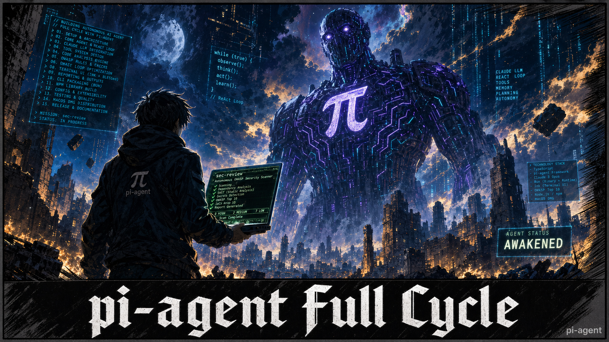

# pi-agent Full Cycle Tutorial



A complete, reproducible 15-chapter course that teaches you how to build a production-ready vertical-domain AI agent from scratch — using [earendil-works/pi](https://github.com/earendil-works/pi) as the foundation.

By the end you will have built **`sec-review`**: an autonomous OWASP security code scanner powered by Claude, shipped as an npm library, a standalone Bun binary, and a signed macOS `.dmg`.

---

## What You Will Build

```
sec-review ./my-app
```

```
┌──────────────────────────────────────────┐
│ sec-review  v1.0.0    claude-sonnet-4-5  │
├──────────────────────────────────────────┤
│ Files: 14/50   Turn: 4/20               │
│ Analyzing: src/auth.ts                  │
├──────────────────────────────────────────┤
│ Findings (2)                             │
│ [CRITICAL] SQL injection · db.ts:47     │
│ [HIGH]     Weak hashing · auth.ts:12    │
├──────────────────────────────────────────┤
│ ► read_file "src/auth.ts"               │
│ ► grep_pattern "eval\s*\("             │
├──────────────────────────────────────────┤
│ Scanning...  [q] quit                   │
└──────────────────────────────────────────┘
```

The agent autonomously explores a codebase, reads source files, runs pattern searches, and produces a structured JSON report categorized by OWASP Top 10 ID — all inside a live terminal UI.

---

## Tutorial Structure

| # | Chapter | Topics |
|---|---------|--------|
| 01 | [Environment Setup](docs/guide/01-environment-setup.md) | Node 22, Bun, API key, pi repo clone, smoke test |
| 02 | [Repository Walkthrough](docs/guide/02-repository-walkthrough.md) | Monorepo layout, pi-ai / pi-agent-core / pi-tui package roles |
| 03 | [Architecture Analysis](docs/guide/03-architecture-analysis.md) | ReAct loop mechanics, AgentTool contract, AgentEvent bus, 3 hook points |
| 04 | [Domain Selection](docs/guide/04-domain-selection.md) | 5-criterion scoring framework, why security review scores 5/5 |
| 05 | [Agent Specification](docs/guide/05-agent-specification.md) | 4 tools, OWASP scope, stop condition, exit codes, hard constraints |
| 06 | [Prompt & Tool Design](docs/guide/06-prompt-and-tool-design.md) | 3-phase system prompt, parameter naming rules, result formatting rules |
| 07 | [Runtime Implementation](docs/guide/07-runtime-implementation.md) | `SecReviewApp`, agent wiring, hooks, stop-signal pattern |
| 08 | [TUI Implementation](docs/guide/08-tui-implementation.md) | pi-tui component model, 5 components, event binding, `--no-tui` mode |
| 09 | [Logging, Config & Errors](docs/guide/09-logging-config-errors.md) | Zod-validated config, structured JSON logger, discriminated error union |
| 10 | [Testing Strategy](docs/guide/10-testing-strategy.md) | 4-layer pyramid: unit → mocked-LLM integration → TUI snapshots → e2e |
| 11 | [npm Package](docs/guide/11-npm-package.md) | ESM-only exports, TypeScript declarations, conditional exports, publishing |
| 12 | [CLI Packaging](docs/guide/12-cli-packaging.md) | Bun standalone binary, cross-platform Makefile, GitHub Actions release |
| 13 | [macOS DMG](docs/guide/13-macos-dmg.md) | Electron + xterm.js shell, code signing, notarization |
| 14 | [Final Project Structure](docs/guide/14-final-project-structure.md) | Directory tree, dependency graph, data flow diagram, build checklist |
| 15 | [Failure Modes & Debugging](docs/guide/15-failure-modes-debugging.md) | 12 failure modes across 3 categories with concrete diagnosis and fixes |

---

## Key Concepts You Will Master

### ReAct Loop
```
User prompt → LLM inference → tool calls? → execute tools → append results → LLM again
                                    └── no tool calls → run_end (loop stops)
```

### AgentTool Contract
```typescript
const tool: AgentTool = {
  name: "read_file",
  description: "Read source file with line numbers prepended",
  parameters: Type.Object({
    path: Type.String({ description: "Relative to scan root, e.g. 'src/auth.ts'" }),
  }),
  async execute(params, signal) {
    if (signal.aborted) return { type: "error", error: "Aborted" };
    return { type: "final", result: JSON.stringify({ content, language, totalLines }) };
  },
};
```

### The Three Hook Points
| Hook | When it fires | What you do with it |
|------|--------------|---------------------|
| `beforeToolCall` | Before every tool execution | Block path traversal, validate inputs |
| `afterToolCall` | After every tool execution | Rewrite results, detect stop condition |
| `prepareNextTurn` | Before each new LLM turn | Enforce turn budget, steer the agent |

### Stop Signal Pattern
```typescript
// write_report is the terminal tool — calling it ends the scan
afterToolCall: async (ctx) => {
  if (ctx.toolCall.name === "write_report") {
    setTimeout(() => agent.abort(), 500); // 500ms lets LLM finish streaming
  }
}
```

### Four Deliverables
```
sec-review
├── npm package     → @your-org/sec-review (ESM, typed)
├── Bun binary      → sec-review-darwin-arm64, linux-x64, windows-x64
├── macOS DMG       → sec-review-1.0.0-arm64.dmg (signed + notarized)
└── JSON report     → OWASP-categorized findings with file, line, snippet
```

---

## Running This Tutorial Locally

### Prerequisites

| Tool | Minimum version |
|------|----------------|
| Node.js | 22.19.0 |
| npm | 10+ |

### Setup

```bash
git clone https://github.com/Heng-xiu/pi-full-cycle-tutorial.git
cd pi-full-cycle-tutorial
npm install
npm run docs:dev
```

Open **http://localhost:5173** in your browser.

### Build for Production

```bash
npm run docs:build     # outputs to docs/.vitepress/dist/
npm run docs:preview   # preview the production build locally
```

---

## Tech Stack

| Layer | Technology |
|-------|-----------|
| Tutorial site | [VitePress](https://vitepress.dev) 1.6 |
| Agent framework | [@earendil-works/pi-agent-core](https://github.com/earendil-works/pi) |
| LLM provider | Anthropic Claude (via @earendil-works/pi-ai) |
| Terminal UI | @earendil-works/pi-tui |
| Runtime | Node.js 22, TypeScript 5.4 |
| Binary compilation | Bun |
| Desktop packaging | Electron + xterm.js |
| Config validation | Zod |
| Testing | Vitest |

---

## Project File Structure (Tutorial Output)

When you complete all 15 chapters, your `sec-review` project will have this layout:

```
sec-review/
├── src/
│   ├── cli.ts                      ← #!/usr/bin/env node entry
│   ├── index.ts                    ← public API exports
│   ├── agent/
│   │   ├── sec-review-app.ts       ← main orchestrator (Agent + EventEmitter)
│   │   ├── system-prompt.ts        ← 3-phase prompt builder
│   │   └── types.ts                ← Finding, ScanSession, OwaspCategory
│   ├── tools/
│   │   ├── list-directory.ts       ← recursive directory listing
│   │   ├── read-file.ts            ← line-numbered file reader
│   │   ├── grep-pattern.ts         ← regex search with context lines
│   │   └── write-report.ts         ← JSON report writer (stop signal)
│   ├── tui/
│   │   ├── sec-review-tui.ts       ← pi-tui layout + event binding
│   │   └── components/             ← Header, Progress, Findings, LogStream, StatusBar
│   ├── config/config.ts            ← Zod schema + load/save
│   └── utils/                      ← errors, logger, shutdown, retry
├── src/tests/
│   ├── tools/                      ← unit tests (no LLM)
│   ├── integration/                ← mocked-LLM tests (vitest + vi.mock)
│   ├── snapshots/                  ← TUI component snapshot tests
│   └── e2e/                        ← real-LLM tests (skipped without API key)
├── electron/                       ← macOS DMG packaging
│   ├── src/main.js                 ← spawns Bun binary via node-pty
│   └── renderer/index.html         ← xterm.js terminal
└── Makefile                        ← `make binary`, `make binary-all`
```

---

## Quick Reference

The [Quick Reference page](docs/reference/quick-reference.md) is a single-page cheat sheet covering:

- Full `Agent` constructor API
- `AgentTool` interface and `AgentToolResult` types
- All `AgentEvent` types and key fields
- Stop condition patterns
- Tool result formatting rules
- Exit code table
- Config file schema
- Build, test, and debug commands
- Common pitfalls and fixes

---

## OWASP Coverage

`sec-review` targets the five OWASP Top 10 categories most detectable through static analysis:

| OWASP ID | Category | Examples detected |
|----------|----------|------------------|
| A01:2021 | Broken Access Control | Missing auth checks, IDOR patterns |
| A02:2021 | Cryptographic Failures | Hardcoded secrets, MD5/SHA1 passwords |
| A03:2021 | Injection | SQL, command, LDAP injection via string concatenation |
| A05:2021 | Security Misconfiguration | `cors({ origin: '*' })`, debug flags in production |
| A07:2021 | Identification & Auth Failures | Weak password policy, `jwt.decode` without verify |

---

## License

MIT — see [LICENSE](LICENSE) for details.

---

## Acknowledgements

- [earendil-works/pi](https://github.com/earendil-works/pi) — the agent framework this tutorial is built on
- [Anthropic Claude](https://anthropic.com) — the LLM powering the agent
- [VitePress](https://vitepress.dev) — the documentation framework
